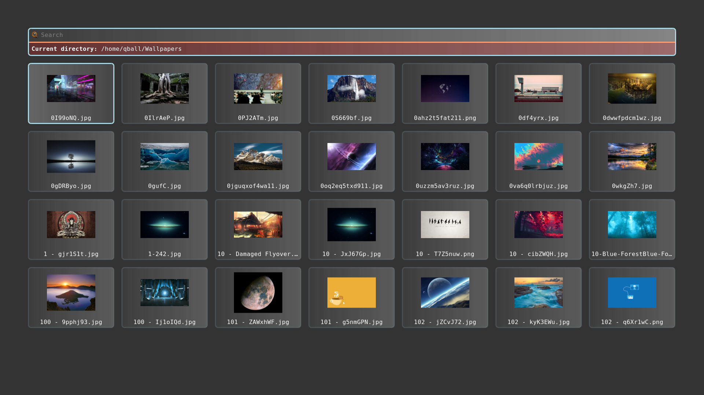
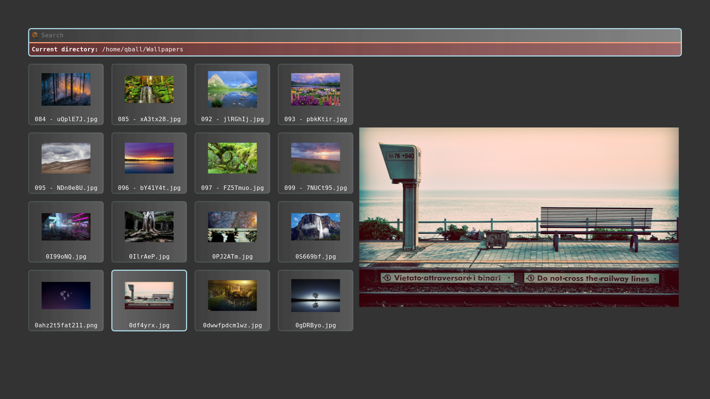

# Dynamic Theme

A new addition in rofi 1.7.5 that did not get a lot of attention is support for
the enabled keyword in the media statement and supporting environment values.
Or more practical, you can modify your theme based on environment variables.

```css

@media ( enabled: env(DO_X, false)) {
  listview {
    orientation: vertical;
  }
}
```

You can now enable this part of the theme by running rofi with `DO_X` set.

```bash
DO_X=true rofi -show combi
```

## Image browser example

In the current release, there is a
[fullscreen_preview](https://github.com/davatorium/rofi/blob/next/themes/fullscreen-preview.rasi)
as an example.

In this theme we are going to modify the filebrowser view with a preview widget that we can enable.

Lets start with the basic theme.

```css
* {
	background-color: transparent;
	text-color:       white;
}

window {
	fullscreen:       true;
	background-color: black/80%;
	padding:          4em;
	children:         [ wrap, listview-split];
	spacing:          1em;
}


/** We add an extra child to this if PREVIEW=true */
listview-split {
  orientation: horizontal;
  spacing: 0.4em;
  children: [listview];
}

wrap {
	expand: false;
	orientation: vertical;
	children: [ inputbar, message ];
	background-image: linear-gradient(white/5%, white/40%);
	border-color: lightblue;
	border: 3px;
	border-radius: 0.4em;
}

icon-ib {
	expand: false;
	filename: "system-search";
	vertical-align: 0.5;
	horizontal-align: 0.5;
	size: 1em;
}
inputbar {
	spacing: 0.4em;
	padding: 0.4em;
	children: [ icon-ib, entry ];
}
entry {
	placeholder: "Search";
	placeholder-color: grey;
}
message {
	background-color: red/20%;
	border-color: lightsalmon;
	border: 3px 0px 0px 0px;
	padding: 0.4em;
	spacing: 0.4em;
}

listview {
	flow: horizontal;
	fixed-columns: true;
	columns: 7;
	lines: 5;
	spacing: 1.0em;
}

element {
	orientation: vertical;
	padding: 0.1em;

	background-image: linear-gradient(white/5%, white/20%);
	border-color: lightblue /15%;
	border: 3px;
	border-radius: 0.4em;

  children: [element-icon, element-text ];
}
element-icon {
	size: calc(((100% - 8em) / 7 ));
	horizontal-align: 0.5;
	vertical-align: 0.5;
}
element-text {
	horizontal-align: 0.5;
	vertical-align: 0.5;
  padding: 0.2em;
}

element selected {
	background-image: linear-gradient(white/25%, white/10%);
	border-color: lightblue;
	border: 3px;
	border-radius: 0.4em;
}

```

When running this theme:
```bash
rofi -theme fullscreen-preview.rasi -show filebrowser
```



We already prepared the place where we are going to add a 2nd widget.
Now lets, at the end of the theme, add the extra element in a media block.


```css
@media ( enabled: env(PREVIEW, false)) {
```
The variable is `PREVIEW`, if it is not set `false` is used.
Otherwise the content of `PREVIEW` is parsed.

These will be merged into the theme on load:

```css

/**
 * Launching rofi with environment PREVIEW set to true
 * will split the screen and show a preview widget.
 */
@media ( enabled: env(PREVIEW, false)) {
  // preview widget
  icon-current-entry {
    expand:          true;
    size:            80%;
  }
  // override the children of `listview-split`
  listview-split {
    children: [listview, icon-current-entry];
  }
  // Reduce to 4 columns
  listview {
    columns: 4;
  }

}
```

Now if we run it:

```bash
REVIEW=true rofi -theme fullscreen-preview.rasi -show filebrowser
```


It looks like this:



We can add more sections; for example for text only we hide the images:

```css
@media ( enabled: env(NO_IMAGE, false)) {
	listview {
		columns: 1;
		spacing: 0.4em;
	}
	element {
		children: [ element-text ];
	}
	element-text {
		horizontal-align: 0.0;
	}
}
```

## Wallpaper picker

If you run latest git version, you can now easily make a wallpaper picker:

```bash
PREVIEW=true rofi -theme fullscreen-preview.rasi -show filebrowser -filebrowser-command 'feh --bg-scale' -filebrowser-directory ~/Wallpapers/
```
